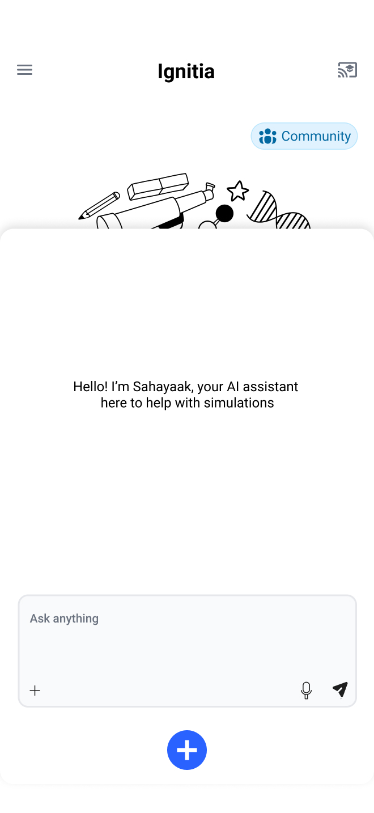

# Ignitia-core

**Your Voice-Controlled, AI-Powered Science Lab**  
_A mobile-optimized, web-based simulation and modeling platform for physics and STEM education._

---

<div width= "60%" style="margin: 0 auto">
  
  
</div>

---

## 🌍 What is Ignitia?

**Ignitia** is an open-source, AI-powered web app that lets students and tutors simulate and explore science through natural conversation — just like Tony Stark and JARVIS.  

It runs directly in the browser with full mobile support, so anyone with a smartphone can interact with real-time physics simulations, manipulate variables, and receive guided explanations — **no laptop, no lab, no problem.**

---

## 🎯 Mission

To make STEM learning **interactive, intelligent, and accessible** — especially for students and educators in under-resourced environments.

---

## 👨🏾‍🏫 Who It's For

- 📱 Students learning science on mobile phones  
- 🧑🏽‍🏫 Tutors teaching physics without lab access  
- 🧪 Curious minds who want to explore science hands-on  
- 🌍 Communities with limited access to laptops or traditional science tools

---

## 🧪 MVP Focus: Physics

The first version of Ignitia will support:

- Motion & Kinematics  
- Forces & Newton’s Laws  
- Energy & Work  
- Rotational Motion  
- Waves & Oscillations  
- Basic Electricity & Magnetism (field visualization)

---

## 🔑 Key Features

| Feature | Description |
|--------|-------------|
| 🎙️ Voice + Text Input | Describe simulations naturally — e.g., “show a cart sliding down a ramp” |
| 📊 Real-Time Simulation | Live 2D or 3D physics models rendered in-browser |
| 🎛️ AI-Controlled Sliders | Adjust variables like mass, angle, friction, force, etc. |
| 📘 Upload Textbook Exercises | Upload scanned questions; AI interprets and generates matching simulations |
| 🧠 Guided Explanations | Step-by-step breakdowns from the AI |
| 📱 Mobile-First Design | Built to work on phones as seamlessly as desktops |

---

## 🛠️ Tech Philosophy

**Ignitia does not lock in a fixed tech stack.**  
We welcome contributors to:

- Propose or use existing simulation engines (e.g., Matter.js, Cannon.js, Ammo.js)  
- Build a custom lightweight physics or sculpting engine  
- Suggest modern frameworks (e.g., React, Vue, Svelte, Solid)  
- Recommend backends or AI integration methods (e.g., OpenAI, Whisper, LangChain)

> We're building a platform together — optimized for education, simplicity, and mobile-first performance.

---

## 🔧 Suggested Stack (Fully Flexible)

| Layer | Options |
|-------|---------|
| Frontend | React, Svelte, Vue, SolidJS (developer’s choice) |
| Rendering | Three.js, PixiJS, WebGL, or custom |
| Simulation | Matter.js, Cannon.js, Ammo.js, or custom-built |
| AI | OpenAI (ChatGPT/Whisper), LangChain, other LLMs |
| OCR | Tesseract.js |
| Backend (optional) | Supabase, Firebase, Node.js, Python, or serverless |

---

## 🤝 Contributing

We welcome contributors of all backgrounds and skill levels.

### We’re especially looking for:

- 🌐 Frontend developers (JavaScript/TypeScript)  
- 🧠 Simulation engine devs and physics hackers  
- 🧪 Educators and science students  
- 🎨 Designers (mobile-first UI/UX)  
- 🤖 AI tinkerers and LLM explorers

> Whether you're solving bugs, designing interfaces, or experimenting with AI prompts — you're welcome.

---

## 📬 Contact

Have questions, feedback, or want to contribute?  
Reach out anytime:

- 📧 Email: [oparamiracle603@gmail.com](mailto:oparamiracle603@gmail.com) 


## 🚀 Getting Started

```bash
# Clone the repository
git clone https://github.com/OparaMiracle12/Ignitia-core.git

# Navigate into the project folder
cd ignitia-lab

# Install dependencies
npm install

# Start the development server
npm run dev
